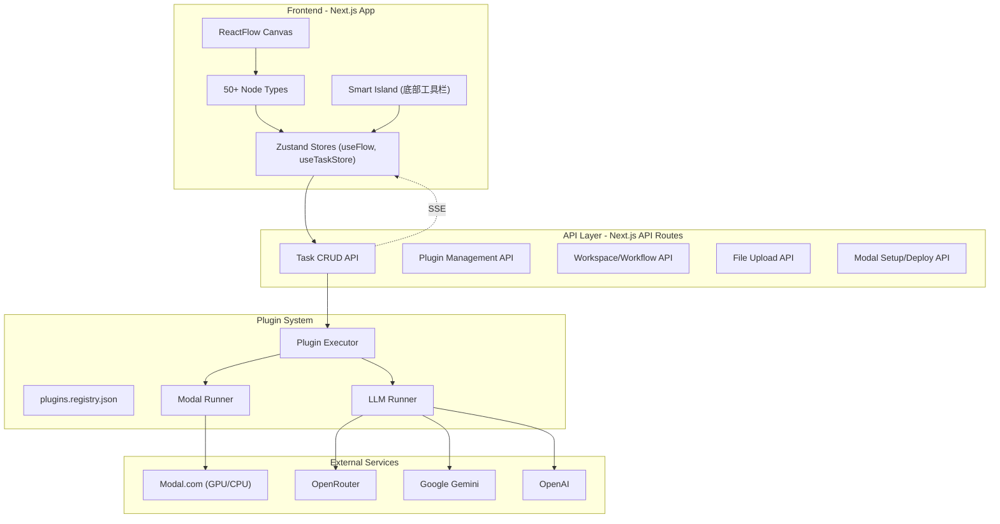

# OpenFlow (TongFlow) 项目 Review

## 项目概览

**TongFlow** 是一个多模态 AIGC 工作室，以可视化节点画布的形式让用户构建端到端的 AI 生成工作流。项目定位为"All models, All modalities, Simple to use"，支持文本、图片、视频、音频、3D 模型等多种模态的生成与变换。

- **License**: AGPL-3.0
- **代码量**: ~43,500 行 TypeScript (src/ 目录)
- **部署形态**: Web (Next.js) + Desktop (Electron) + Docker

---

## 技术栈

| 层面 | 技术选型 |
|------|----------|

- **前端框架**: Next.js 15.4 + React 19 + TypeScript 5
- **画布引擎**: @xyflow/react 12.9 (ReactFlow)
- **状态管理**: Zustand 5.0
- **UI 组件**: Radix UI + Tailwind CSS 4 + Lucide Icons + shadcn/ui 风格
- **表单**: React Hook Form + Zod 4 校验
- **国际化**: next-intl (中/英/日)
- **数据库**: Better-SQLite3 + Drizzle ORM
- **桌面端**: Electron 37
- **AI 推理后端**: Modal.com (云 GPU/CPU)
- **LLM 集成**: OpenRouter / Google Gemini / OpenAI / DeepSeek
- **代码格式化**: Biome
- **3D**: Three.js

---

## 架构分析

### 整体架构



### 核心设计模式

**1. 节点系统 (Node System)**
- 50+ 种节点类型，分为 6 大类：Data / Add / Transform / Compose / Batch / Decompose
- 所有节点基于 `BaseNode` 组件，统一处理：执行按钮、loading 状态、进度条、插件选择、上游数据获取
- 节点通过 `workflowConfig` 声明式配置（feature、getPrompts、输出类型等），`BaseNode` 自动处理执行逻辑

**2. 插件系统 (Plugin System)**
- 插件分为两类 runner：`modal`（Modal.com 云函数）和 `llm`（LLM API 调用）
- `.tongflow/plugins.registry.json` 维护插件注册表，映射 nodeSlot -> pluginId
- 每个 Modal 插件是独立的 Python 项目（独立 git repo），包含 `deploy.py`、`download.py` 等
- 插件执行通过 `executePlugin()` 统一入口，按 runner 类型分发

**3. 任务系统 (Task System)**
- 前端通过 `POST /api/task/create` 创建任务
- 使用 SSE (Server-Sent Events) 实时推送任务进度
- `useTaskStore` 管理全局任务状态，`routeTaskToNode` 将任务结果路由回对应节点
- 支持批量任务、任务取消、指数退避重连

**4. 状态管理**
- `useFlow` (Zustand): 管理 ReactFlow 的 nodes/edges，支持 localStorage 持久化（带防抖）
- `useTaskStore` (Zustand): 管理任务生命周期、节点-任务映射、handler 路由
- 无全局 Redux，各关注点分离

---

## 项目亮点

1. **丰富的模态覆盖**: 已实现 50+ 节点类型，覆盖文本、图片、视频、音频、3D、文档等全模态
2. **插件化 AI 后端**: 通过 ABI + Plugin Registry 解耦前端节点与后端 AI 模型，新增模型只需注册插件
3. **统一的节点框架**: `BaseNode` + `workflowConfig` 让新节点开发非常标准化
4. **多种部署方式**: Web / Electron Desktop / Docker，覆盖不同用户群
5. **国际化**: 完整的中英日三语支持
6. **Modal.com 集成**: 巧妙利用 Modal 的免费额度降低 GPU 推理门槛
7. **工作流系统**: 支持工作流保存/恢复/分享/执行

---

## 需要关注的问题

### 1. 缺少测试 (Critical)
- **没有发现任何测试文件**（无 `__tests__`、`*.test.ts`、`*.spec.ts`）
- 对于一个 43K+ 行的项目，没有测试覆盖是重大风险
- 建议优先为核心逻辑添加测试：插件执行、任务路由、节点配置注册、工作流导出

### 2. localStorage 作为主要持久化 (Medium)
- 节点和边数据通过 localStorage 持久化，虽然有 SQLite 做工作流存储
- localStorage 有 5MB 限制，复杂工作流可能超限
- 没有看到 localStorage 写入失败的错误处理

### 3. SSE 连接管理 (Medium)
- `useBatchTaskManager` 为每个任务创建独立的 EventSource 连接
- 批量任务多时可能产生大量并发 SSE 连接
- 使用 `(window as any).__batchCancelTimeoutId` 存储定时器 ID 是反模式

### 4. TypeScript 类型安全 (Low-Medium)
- 多处使用 `as any` 类型断言（如 `use-task.ts` 中的 SSE 消息处理）
- `BaseNode` 的 `data` prop 使用 `Record<string, unknown>` 缺少具体类型
- 部分 handler 缺少完整类型标注

### 5. 错误处理可以更健壮
- SSE 连接错误主要靠 console.error + toast
- 任务失败后没有看到明确的重试机制（前端层面）
- 插件执行失败的错误信息传递链路可以更清晰

### 6. 安全考量
- `.env` 中存储大量 API keys，需确保 `.gitignore` 完善
- Modal token 存储在 `~/.modal.toml`，桌面端需要注意保护
- AGPL-3.0 许可证对商业使用有较强限制

---

## 开源 Checklist

### 必要文件

| 文件 | 状态 | 说明 |
|------|------|------|
| LICENSE | ✅ 已有 | AGPL-3.0 |
| README.md | ✅ 已有 | 内容完整，包含安装、使用、功能列表 |
| .gitignore | ✅ 已有 | 覆盖全面 |
| .env.example | ✅ 已有 | 所有环境变量都有文档 |
| CONTRIBUTING.md | ✅ 已有 | 贡献指南（代码规范、PR 流程、开发环境搭建） |
| CODE_OF_CONDUCT.md | ✅ 已有 | Contributor Covenant 2.0 |
| SECURITY.md | ✅ 已有 | 安全漏洞上报流程 |
| CHANGELOG.md | ✅ 已有 | Keep a Changelog 格式 |

### GitHub 配置

| 项目 | 状态 | 说明 |
|------|------|------|
| CI/CD | ✅ 已有 | lint + typecheck + build + desktop release |
| Issue 模板 | ✅ 已有 | `bug_report.yml`、`feature_request.yml` + `config.yml` |
| PR 模板 | ✅ 已有 | `.github/PULL_REQUEST_TEMPLATE.md` |
| Dependabot | ✅ 已有 | npm 周更 + GitHub Actions 月更 |
| 仓库名一致性 | ✅ 已统一 | README 链接已更新为 `tongflow` |

### 代码质量

| 项目 | 状态 | 说明 |
|------|------|------|
| 无硬编码密钥 | ✅ 通过 | 未发现泄露的 API key |
| 无个人路径 | ✅ 通过 | 未发现硬编码的本地路径 |
| TODO/FIXME 清理 | ⚠️ 3 处 | `json-sse.ts`(1), `validation.constant.ts`(2) |
| 测试覆盖 | ❌ 缺失 | 无测试文件（Critical） |
| 文档完整性 | ⚠️ 基础 | 有 3 个 docs，但缺少架构文档、API 文档 |

### 发布准备

| 项目 | 状态 | 说明 |
|------|------|------|
| 版本号 | ⚠️ 0.1.0 | package.json 中为 0.1.0，确认是否为首发版本 |
| Desktop Release | ✅ 已配置 | tag 触发自动发布到 GitHub Releases |
| Docker 镜像 | ✅ 已有 | GHCR：`ghcr.io/tong-io/tongflow`（`main`/`v*` + PR 仅构建） |
| npm 包 | N/A | 非 npm 库项目 |

### 建议优先级

**P0 - 发布前必须**
1. [x] 创建 `CONTRIBUTING.md`（贡献指南）
2. [x] 创建 `SECURITY.md`（安全政策）
3. [x] 确认仓库名：已统一为 `tongflow`
4. [ ] 清理 3 处 TODO/FIXME 注释

**P1 - 发布后尽快**
1. [x] 创建 `CODE_OF_CONDUCT.md`
2. [x] 添加 Issue / PR 模板
3. [x] 创建 `CHANGELOG.md`
4. [x] 添加 Dependabot 配置
5. [ ] 添加核心模块测试

**P2 - 持续改进**
1. [ ] 完善架构文档（数据流、插件开发指南）
2. [ ] 添加 API 文档（REST endpoints）
3. [x] 配置 Docker 镜像自动发布
4. [ ] 添加 Codecov / 测试覆盖率徽章

---

## 目录结构总结

```
openflow/
  src/
    app/                    # Next.js App Router 页面和 API
      api/                  # REST API routes (task, plugins, workspace, etc.)
      workspace/            # 主工作区页面
      plugins/              # 插件管理页面
    components/
      workspace/            # 核心工作区组件
        nodes/              # 50+ 节点实现
          add/              # 添加节点（输入）
          transfer/         # 变换节点
          compose/          # 合成节点
          decompose/        # 分解节点
          batch/            # 批处理节点
          modal/            # 数据展示节点
          base/             # BaseNode 基础组件
        smart-island.tsx    # 底部智能工具栏
        workspace.tsx       # 主画布
      ui/                   # shadcn/ui 组件
    hooks/                  # Zustand stores + custom hooks
    lib/                    # 核心库代码
      plugin-executor/      # 插件执行引擎
    handlers/               # 后端处理函数 (LLM, file utils)
    services/               # 服务层 (task completion)
    messages/               # i18n 翻译文件
  plugins/                  # ~20 个独立插件 (Python, 各自独立 git repo)
  config/                   # 配置文件 (ABI, features, market)
  .tongflow/                # 运行时生成的插件注册表
  electron/                 # Electron 主进程
  packages/proprietary/     # 可选闭源扩展包
```

---

## 总结

OpenFlow 是一个**架构设计清晰、功能覆盖全面**的 AIGC 工作流平台。插件化的 AI 后端设计、统一的节点框架、以及丰富的模态支持都体现了良好的工程思路。

**已完成的改进：**
- ✅ CI/CD 流水线（lint + typecheck + build）
- ✅ BaseNode 组件重构（970行 → 281行）
- ✅ console.log 清理，引入结构化日志
- ✅ 文件命名规范统一（kebab-case）
- ✅ 社区文档与模板（CONTRIBUTING、SECURITY、CODE_OF_CONDUCT、CHANGELOG、Issue/PR、Dependabot）
- ✅ Docker 镜像发布至 GHCR（`docker-publish` workflow）

**开源前重点：**
- ✅ `CONTRIBUTING.md`、`SECURITY.md`、`CODE_OF_CONDUCT.md`、`CHANGELOG.md`
- ✅ Issue/PR 模板与 Dependabot
- 清理残留的 TODO 注释（P0 未完成项）

整体而言，代码质量和架构选型都在合理水平，具备良好的扩展性基础，已基本具备开源条件。
