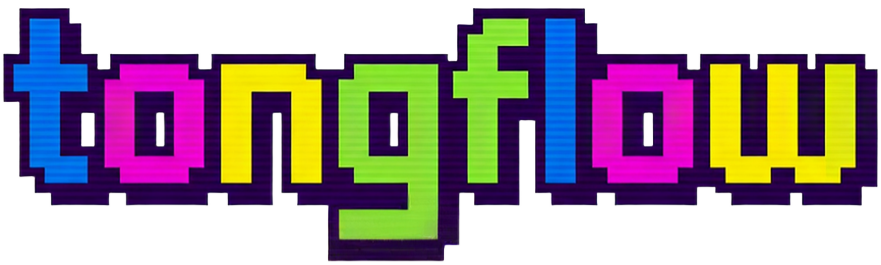

<div align="center">
  

  <h1>TongFlow - 一个多模态生成式AI创作引擎</h1>

  <!-- CI / Discord / Releases 为占位，接入后替换链接 -->
  <p>
    <a href="https://github.com/tong-io/openflow/stargazers"></a>
    <a href="https://github.com/tong-io/openflow/blob/main/LICENSE"></a>
    <a href="#"></a>
    <a href="#"></a>
    <a href="#"></a>
  </p>
</div>

这是能够运行在本地的AI创意工厂：在无限画布上添加，转换，组合，就能实现AIGC工作流。

目前我们默认接入modal.com，你可以免费获得每月30美元的算力额度，实现免费的AI创作和内容生成。

## 如果你觉得这个项目不错，请给我一个Star，我们非常感谢。

## 核心理念

- 可集成所有生成式AI模型：任何生成式AI模型都能够抽象为“模态的转换”。如：LLM是文本转文本，图像生成是文本转图片，歌曲生成是文本转音乐，等等。基于此，tongflow可以将任何生成式AI模型封装为节点。

- 可支持所有模态：我们实现并支持了所有能够在网络上分发的模态或传播形式。

- 简单操作：没有晦涩的参数，无需拖拽连线，只需要添加，转换和组合三种操作。可以自由的编排创意。

## Demo用例：（这只是冰山一角，用生成式AI延展你的想象力吧）

- 文生图生视频：出图再做成视频。

- 口播数字人：口播稿加数字人画面。

- 电商图片合成：多图融合或改商品图。

- AI音乐制作：按描述生成音乐。

- AI短剧/漫剧：按描述生成音乐。

### 已实现能力

#### 添加

- 输入文本：输入文本，添加文本节点。

- 添加图片：选择本地文件，添加为图片节点。

- 添加照片：用设备相机拍照，添加为图片节点。

- 添加涂鸦：在画板绘制草图，添加为图片节点。

- 添加音频：选择本地音频文件，添加为音频节点。

- 录制音频：用设备麦克风录制，添加为音频节点。

- 添加视频：选择本地视频文件，添加为视频节点。

- 录制视频：用设备摄像头录制，添加为视频节点。

- 添加文档：选择本地文档，添加为文档节点。

- 添加网址：输入链接抓取网页，添加为文本，图片，音频或视频节点。

- 添加3D模型：选本地模型文件，生成模型类节点。，添加为图片节点。

#### 转换

##### 文本

- 文本生成/改写：按提示生成或改写文字。

##### 图片

- 图像生成：文字描述出图。

- 图像编辑：按指令改图或重绘。

- 图像理解：看图写说明或问答。

- 图像超分：放大图片提高清晰度。

##### 视频

- 视频生成：文字描述生成视频。

- 图生视频：静态图生成动态视频。

- 首尾帧生成视频：两张图固定起止画面生成视频。

- 视频理解：看视频写摘要或说明。

- 视频超分：提高视频清晰度。

- 抽取视频首帧 / 尾帧：从视频里截一帧当图。

- [ ] **视频去字幕**
- [ ] **视频去水印**

##### 音频

- 音乐生成：文字描述生成音乐。

- 语音合成：文字转语音，可录参考声线。

- 语音识别：人声或视频里的说话声转成文字。

- [ ] **音频降噪**
- [ ] **多音轨 / 人声与伴奏分离**
- [ ] **说话人分离**
- [ ] **人声 / 音色替换**（参考音色驱动）

#### 组合

- 多图融合（Image Fusion）：多图参考合成或编辑成一张图。

- 对口型：语音 + 视频 → 视频：含对口型等变体。

- 人物替换：视频 + 参考图（画面混合 / 人物替换）：Animate Mix 类生成。

- 动作迁移：视频 + 参考图（动作 / 迁移）：Animate Move 类生成。

#### 其他

- [ ] **Image → 3D 模型**（单视图生成 3D）
- 文档解析为文本：文档转成纯文本。

- 链接抓取为文本：网页内容收成文字。

#### 其他辅助

- 多段视频拼接：多段视频首尾相接成一条。

- 音视频合成：视频与音频合成一个文件。

- 视频按分镜切片：按分镜把长视频切成多段。

- 音轨分离：抽出单独音频。

- 长文本拆成多段：把一篇长文切成多段。

- 多段文本合并/整理：合并多段字；须用自动合并选项。

- [ ] **按条件筛选 / 丢弃视频片段**（自然语言或规则筛选）
- [ ] **多段视频的排列组合 / 分组编排**（批量成组输出）

## 后端与模型提供商（Providers）

- **Modal（CPU/GPU workers）**：用于 FFmpeg、场景切分、GPU 推理（Z-Image / FLUX / LTX-2 / SeedVR2 / Gemma4 / Qwen3 等）
- **OpenRouter（LLM 路由）**：默认文本生成 `gen_text` 的免费路由/模型（可用 `.env` 覆盖）
- **Google Gemini（API）**：用于部分文本/多模态 API 任务（需要 `GEMINI_API_KEY` 或 `GOOGLE_API_KEY`）
- **DeepSeek（API）**：用于部分文本编排/推理（需要 `DEEPSEEK_API_KEY`）
- **OpenAI（API）**：提供 `openai-text` handler（默认 `OPENAI_CHAT_MODEL=gpt-4o-mini`）

## 本地运行（Quickstart）

### 三种启动方式

#### 1) 直接下载 Release 桌面版（推荐给普通用户）

- 到 GitHub 的 Releases 页面下载对应系统的安装包（macOS / Windows）。
- 首次使用仍需要你在应用内/环境变量里配置 Modal/OpenRouter/Gemini 等 API key/token（见下方“环境变量”）。

#### 2) Docker Compose 一键启动（推荐给自托管/部署）

仓库根目录已提供 `compose.yaml`：

```bash
docker compose up --build
```

启动后访问 `http://localhost:3000`（会进入 `/workspace`）。

> 数据会持久化在 Docker volume（包含 SQLite：`data/openflow.db` 与上传文件）。

#### 3) 本地开发启动（pnpm dev）

依赖：Node.js（建议 Node 20+）与 pnpm。

```bash
pnpm install
pnpm dev
```

启动后访问 `http://localhost:3000`（会进入 `/workspace`）。

### 环境变量（Modal / 各类模型提供商）

本项目会调用外部服务（例如 Modal / OpenRouter / Gemini / DeepSeek / OpenAI）。你可以用 `.env` 来配置。

常用变量（以 `.env` 为准）：

- `MODAL_TOKEN_ID` / `MODAL_TOKEN_SECRET`：Modal worker 调用
- `OPENROUTER_API_KEY` / `OPENROUTER_FREE_MODEL`：OpenRouter LLM
- `GEMINI_API_KEY` / `GOOGLE_API_KEY`：Gemini
- `DEEPSEEK_API_KEY`：DeepSeek
- `OPENAI_API_KEY` / `OPENAI_CHAT_MODEL`：OpenAI
- `NEXT_PUBLIC_TASK_API_URL`：可选，把任务 wait/stop 指向外部任务服务
- `NEXT_PUBLIC_FILE_BASE_URL`：可选，文件存储的 base URL

如果你要做 Modal 授权（会把 token 写入 `~/.modal.toml`）：

```bash
pnpm modal:setup
```

## 开源计划

我们将在star数达到一定程度后开源社区版全部代码。

## 联系

欢迎通过Discord或微信群加入社区


商务合作请发邮件：business@tongflow.com，会尽快联系您。
 - 如果您是B端用户，我们可以为您定制部署私有版本
 - 如果您是投资人，我们可以探讨推进Cloud版本的构建
 - 如果您是模型API提供/中转/聚合商，我们可以将您的API集成
 - 如果您是开源模型发布者，我们可以以最快速度集成进来供用户试用

## License

This project is licensed under **GNU Affero General Public License v3.0 (AGPL-3.0-only)**.

- If you modify and run it as a network service, you must offer users the Corresponding Source of your modified version (see AGPL section 13).

## Star History

[](https://star-history.com/#tong-io/openflow&Date)