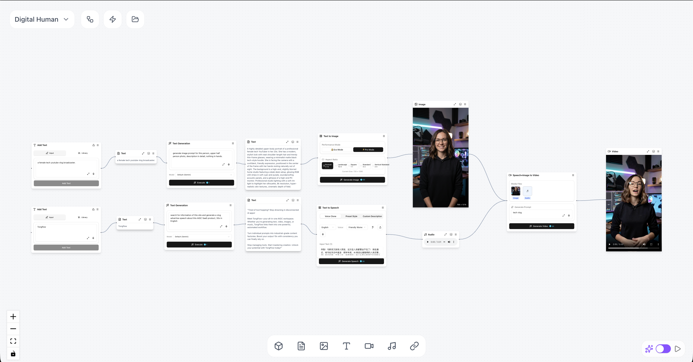
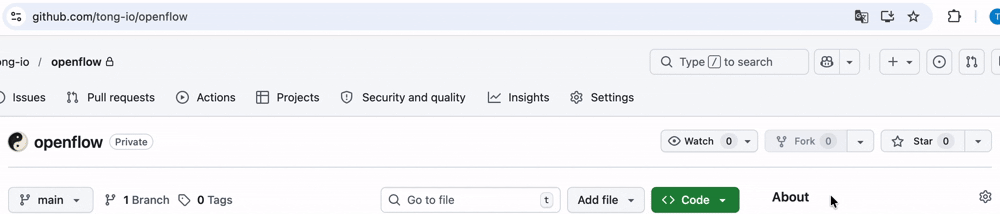

<div align="center">
  

  <h1>多模态 AIGC 创作工作室</h1>
  <p>
    <a href="https://github.com/tong-io/tongflow/stargazers"></a>
    <a href="https://github.com/tong-io/tongflow/blob/main/LICENSE"></a>
    <a href="https://github.com/tong-io/tongflow/actions/workflows/ci.yml"></a>
    <a href="https://discord.gg/K7V8az94Zf"></a>
    <a href="https://github.com/tong-io/tongflow/releases"></a>
  </p>
</div>

**TongFlow** 是一款一站式 AIGC 创作工作室，帮助你端到端构建多模态生成式 AI 工作流。

<div align="center">
  
</div>

## 核心理念

- **全模型**: AI 模型可理解为**模态转换**（例如 LLM 是文本→文本，图像模型是文本→图像，音乐模型是文本→音频等）。TongFlow 将每种能力封装为节点。

- **全模态**: 支持 Web 上实际流通的所有模态与格式。

- **简单易用**: 无复杂参数面板，无需手动连接节点；只需**添加**、**转换**和**组合**，自由排列创意。

## 应用场景

- **文本 → 图像 → 视频**: 生成图像，再将其转化为视频。
- **数字人**: 台词脚本 + 数字人形象。
- **电商图片**: 多图融合或产品图修图。
- **AI 音乐**: 从文本提示生成音乐。
- **AI 短剧 / 漫画**: 从描述生成故事或剧集。

用 TongFlow 释放想象力，借助生成式 AI 拓展你的创意边界！

## 快速开始（本地运行）

这是一款**本地优先**的应用：工作流与素材存储在 SQLite（`data/openflow.db`），上传文件保存在磁盘（`data/uploads/`）。无需 TongFlow 账号、登录或中心化文件 CDN。

AI 推理使用**你配置的外部 API**：大多数转换插件使用 [Modal](https://modal.com)（Modal 提供 **每月 $30 免费额度**，可用于 H100 等云端 GPU/CPU），LLM 节点使用 OpenRouter、Gemini、OpenAI 等供应商。请在 `.env` 中配置 API Key，使用 Modal 时运行 `pnpm modal:setup`（详见下方**环境变量**）。

### 两种运行方式

#### 1) Docker Compose（推荐自托管）

仓库根目录提供 `compose.yaml`：

```bash
docker compose up --build
```

打开 `http://localhost:3000`（进入 `/workspace`）。

> 数据持久化在 Docker Volume（SQLite 位于 `data/openflow.db`，含上传文件）。

**预构建镜像（GHCR）：** CI 在 `main` 分支推送时自动发布 [`ghcr.io/tong-io/tongflow`](https://github.com/tong-io/tongflow/pkgs/container/tongflow)（标签 `latest` 和 `main`），版本标签 `v*` 也同步发布（如 `v0.1.0` → `0.1.0`）。拉取并运行：

```bash
docker pull ghcr.io/tong-io/tongflow:latest
docker run --rm -p 3000:3000 --env-file .env -v openflow_data:/app/data ghcr.io/tong-io/tongflow:latest
```

私有仓库可能需要先 `docker login ghcr.io`（Token 需有 `read:packages` 权限）。

#### 2) 本地开发（`pnpm dev`）

需要 Node.js（建议 20+）和 pnpm。

```bash
pnpm install
pnpm dev
```

打开 `http://localhost:3000`（进入 `/workspace`）。

### 环境变量（Modal 与各服务商）

应用调用 **Modal**（Worker 执行）和可选的 **LLM / API** 服务。将 [`.env.example`](.env.example) 复制为 `.env` 并填写 Key。核心编辑、保存和导入/导出功能无需任何 TongFlow 托管服务。

常用变量：

- `MODAL_TOKEN_ID` / `MODAL_TOKEN_SECRET`：Modal Worker
- `OPENROUTER_API_KEY`（可选：`OPENROUTER_FREE_MODEL`、`OPENROUTER_HTTP_REFERER`、`OPENROUTER_APP_TITLE`）：默认**生成文本**节点（`gen_text`）使用 OpenRouter 免费路由
- `GEMINI_API_KEY` 或 `GOOGLE_API_KEY`：模型选择 Gemini 时的**生成文本**及其他 Gemini 多模态处理
- `OPENAI_API_KEY`（可选：`OPENAI_CHAT_MODEL`）：模型选择 OpenAI 时的**生成文本**；默认模型为 `gpt-4o-mini`
- `DEEPSEEK_API_KEY`：仅用于直接调用 DeepSeek API 的功能（如批量排列/分组文本），非主文本生成下拉
- `NEXT_PUBLIC_TASK_API_URL`：可选；将任务等待/停止指向外部任务服务
- `NEXT_PUBLIC_FILE_BASE_URL`：可选；文件存储的 Base URL

授权 Modal（Token 写入 `~/.modal.toml`）：

```bash
pnpm modal:setup
```

## 已实现功能

### 添加

- ✅ **文本输入**: 输入文字并添加文本节点。
- ✅ **添加图片**: 选择本地文件并添加图片节点。
- ✅ **拍照**: 用设备摄像头拍摄并添加图片节点。
- ✅ **添加草图**: 在画布上绘制并添加图片节点。
- ✅ **添加音频**: 选择本地音频文件并添加音频节点。
- ✅ **录音**: 用麦克风录音并添加音频节点。
- ✅ **添加视频**: 选择本地视频文件并添加视频节点。
- ✅ **录制视频**: 用摄像头录制并添加视频节点。
- ✅ **添加文档**: 选择本地文件并添加文档节点。
- ✅ **添加链接**: 从链接抓取页面，添加文本、图片、音频或视频节点。
- ✅ **添加 3D 模型**: 选择本地模型文件并添加 3D 模型节点。

### 转换

#### 文本

- ✅ **生成 / 改写**: 根据提示创建或编辑文案。

#### 图像

- ✅ **图像生成**: 从文本生成图像。
- ✅ **图像编辑**: 局部重绘、编辑或按指令重画。
- ✅ **图像理解**: 从图像生成描述、问答或说明。
- ✅ **图像超分**: 放大以获得更清晰的细节。

#### 视频

- ✅ **视频生成**: 从文本生成视频。
- ✅ **图生视频**: 将静态图像动态化。
- ✅ **首尾帧视频**: 用两张关键帧插值生成片段。
- ✅ **视频理解**: 从视频生成摘要或描述。
- ✅ **视频超分**: 输出更高分辨率的视频。
- ✅ **提取首帧 / 尾帧**: 将帧提取为图片。
- ✅ **去字幕**: 从视频中清除字幕。
- ✅ **去水印**: 从视频中去除水印。

#### 音频

- ✅ **音乐生成**: 从文本生成音乐。
- ✅ **语音合成**: 文字转语音——预设风格、声音克隆（参考音频）或指令驱动。
- ✅ **语音识别**: 转录音频或视频中的语音。
- ✅ **降噪**: 对音频降噪处理。
- ✅ **说话人分离**: 按说话人分离音频。
- ✅ **音色转换**: 使用参考样本替换或克隆音色。
- ⬜ **多轨 / 人声伴奏分离**

### 组合

- ✅ **图像融合**: 将多张参考图融合或编辑为一张图。
- ✅ **口型同步**: 音频 + 视频 → 视频（口型同步）；也支持音频 + 图片 → 视频、音频 + 文本 → 视频、音频 + 图片 + 视频 → 视频等变体。
- ✅ **声音克隆合成**: 文本 + 参考音频 → 克隆指定音色的语音。
- ✅ **换角色**: 视频 + 参考（场景融合 / 角色替换），Animate Mix 风格生成。
- ✅ **动作迁移**: 视频 + 参考（动作 / 重定向），Animate Move 风格生成。
- ✅ **文本合并**: 将多个文本节点合并为一个。

### 其他

- ✅ **图像 → 3D**: 从单张图像生成 3D 模型。
- ✅ **文档 → 文本**: 从文档中提取纯文本。
- ✅ **链接 → 文本**: 将页面内容转换为文本。

### 辅助工具

- ✅ **拼接片段**: 将多个视频首尾相接。
- ✅ **音视频合并**: 合并为单个文件。
- ✅ **按镜头分割**: 按场景将长视频切分。
- ✅ **拆分音视频**: 将视频解封装为独立的视频轨和音频轨。
- ✅ **提取音轨**: 将音频单独导出为资源。
- ✅ **分割长文本**: 将长段落拆分为块。
- ✅ **合并 / 整理文本块**: 合并片段（可使用自动合并选项）。
- ✅ **过滤 / 丢弃片段**: 按规则或手动选择丢弃不需要的片段。
- ✅ **排列与批量分组**: 对文本或片段批次进行分组排列，供下游处理使用。

## 后端与模型服务

- **FFmpeg**: 转码、混流与媒体处理管线
- **场景检测**: 用于分割片段的镜头边界检测
- **Z-Image**: 文本生图
- **FLUX.2 Klein 9B**: 多参考融合与图像编辑
- **LTX-2**: 文本 / 图像生视频
- **SeedVR2**: 图像和视频超分辨率
- **Gemma 4**: 多模态文本（图像 / 视频理解）
- **Qwen3**: 语音识别与文字转语音
- **ACE-Step**: 文本生音乐
- **OpenRouter（LLM 路由）**: `gen_text` 的默认免费路由/模型（`OPENROUTER_API_KEY`；可选 `OPENROUTER_FREE_MODEL`）
- **Google Gemini（API）**: `gen_text_gemini` 及相关处理（设置 `GEMINI_API_KEY` 或 `GOOGLE_API_KEY`）
- **OpenAI（API）**: `gen_text_openai`（`OPENAI_API_KEY`；可选默认 `OPENAI_CHAT_MODEL`）
- **DeepSeek（API）**: 仅用于直接调用 DeepSeek 的代码路径（如批量文本分组），非主**生成文本**模型列表

## 联系我们

**社区：** 加入 **[Discord](https://discord.gg/K7V8az94Zf)** 或扫描下方**微信群**二维码。

<div>
  
</div>

**商务合作：** 请联系 business@tongflow.com，我会尽快回复。

- **开源模型发布者**：我可以集成你的模型，让用户流畅体验。
- **企业用户**：我可以协助在本地 GPU 上部署、构建定制节点等。
- **API 供应商 / 路由**：我可以接入你的 API。
- **投资方**：欢迎探讨在 tongflow.com 云端 AI 工作室上的合作。

## 开源

如果你喜欢这个项目，在 GitHub 上 Star 一下非常有帮助，感谢！

<div align="center">
  
</div>

本项目基于 **AGPL-3.0** 协议开源。

## 扩展 AI 能力

功能元数据（模型插槽、处理路由键、耗时提示）集中在 [`config/features.default.json`](config/features.default.json)。覆盖方式、校验（`pnpm validate-features`）以及与任务处理器和节点白名单的关系，请参阅 [docs/feature-registry.md](docs/feature-registry.md)。私有部署的可选后构建客户端混淆方案，请参阅 [docs/closed-source-build.md](docs/closed-source-build.md)。可选的闭源钩子位于工作区包 [`@openflow/proprietary`](packages/proprietary/)，详见 [docs/proprietary-package.md](docs/proprietary-package.md)。

## Star 历史

[](https://star-history.com/#tong-io/tongflow&Date)
