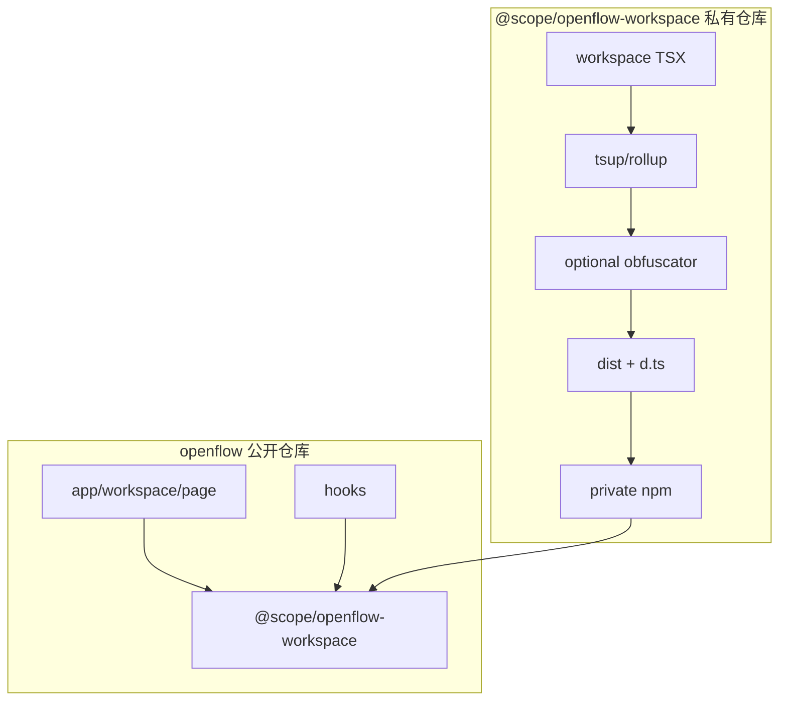

# Workspace 私有 npm 包方案

> **状态**：计划文档；**待开发稳定后再拆包**，实施时与代码同步更新本文件。

将 `src/components/workspace` 抽成独立私有 npm 包（构建后可混淆），主开源仓库仅声明依赖与薄适配层；通过私有 registry 或 tarball 分发，不随公开源码提供 UI 实现。

**实施前 checklist（与 Cursor 计划一致）**

- [ ] 梳理 workspace 与 hooks、db schema、api 的边界；确定 peerDependencies 与 `exports` 公开 API（含 TaskProgressToast 等）
- [ ] 新建包仓库/目录：package.json、tsconfig、tsup 或 rollup 构建、obfuscate 可选步骤、发布到私有 npm
- [ ] 迁移 `src/components/workspace` 源码与仅其需要的 assets；修正内部 `@/` 别名 imports
- [ ] 主仓删除 workspace 源码，`page.tsx`/hooks 改为从 `@scope/package` 导入；必要时抽共享 types 到主仓小文件
- [ ] 主仓 README/LICENSE 说明专有包获取方式；私有包内保留 LICENSE 与第三方声明

---

## 目标

- **公开仓库**：不包含 `src/components/workspace` 源码；可正常 `pnpm install`（需 registry 令牌或文档化的 `file:`/ tarball 流程）。
- **私有包**：含完整 TSX 实现；CI 产出 **ESM（及可选 CJS）** + `.d.ts`，可选 **混淆** 后发布。

浏览器端无法绝对防逆向；此方案兼顾 **源码不公开** 与 **版本化依赖**。

---

## 现有耦合（拆包时要处理）

| 消费者 | 现状 |
|--------|------|
| [`src/app/workspace/page.tsx`](../src/app/workspace/page.tsx) | `import Workspace from "@/components/workspace/workspace"` |
| [`src/hooks/use-task.ts`](../src/hooks/use-task.ts)、[`src/hooks/use-workflow-recovery.ts`](../src/hooks/use-workflow-recovery.ts) | `@/components/workspace/task-progress-toast` |
| [`src/db/schema.ts`](../src/db/schema.ts) | [`src/modules/workspace/schemas/workspace.schema.ts`](../src/modules/workspace/schemas/workspace.schema.ts) — **建议留在主仓**（数据层与 UI 解耦），私有包若需类型可 `peer` 或重复窄类型 |

主仓保留：[`src/lib/api/workspace.ts`](../src/lib/api/workspace.ts)、[`src/app/api/workspace/`](../src/app/api/workspace)（除非你也想私有化后端，本方案默认 **API 仍开源**）。

---

## 私有包设计要点

### 命名与位置

- **独立 Git 仓库**（推荐）：例如 `github.com/your-org/openflow-workspace`，便于独立 CI 与权限。
- 包名：`@your-scope/openflow-workspace`（npm org 需与 scope 一致）。

### `package.json` 要点

- **peerDependencies**：`react`、`react-dom`、与主项目一致的 `next`（若包内用 `next/image` 等则列出；否则尽量只用 `react` 以减少耦合）。
- **dependencies**：UI 库（Radix、tailwind 类名若由主仓提供则通过 `peer` 或文档约定）、`@xyflow/react` 等 workspace 实际用到的依赖 **锁在私有包内**，避免主仓 duplicate。
- **exports**：例如 `"."` → 主入口导出默认 `Workspace`；`"./task-progress-toast"` → 供 hooks 使用，避免深层路径泄露。

### 构建

- **tsup** 或 **rollup** + `typescript`：多入口若需要（`main` + `task-progress-toast`），或单入口 re-export 子模块。
- **external**：`react`、`react-dom`、`next`、`next/*`（按实际 import），不打进 bundle。
- **可选**：构建后对 `dist/**/*.js` 跑 `javascript-obfuscator`（注意与 SSR/服务端组件兼容性——若 Workspace 为 client 组件，仅混淆客户端产物或仅混淆 `use client` 边界后的 chunk，需实测 Next 15）。
- 发布内容：`dist/` + `package.json` + `README`（可极简），**不发布** `src/`（`files` 字段白名单）。

### 类型

- 生成 `.d.ts` 随包发布，主仓获得 IDE 提示；混淆不改变类型。

---

## 主仓（开源）改动

1. **删除** `src/components/workspace/`（或保留占位 `README` 指私有仓库）。
2. **`package.json`**：`"@your-scope/openflow-workspace": "^x.y.z"`，并配置 **`.npmrc`**：`@your-scope:registry=https://registry.npmjs.org/` + `//registry.npmjs.org/:_authToken=${NPM_TOKEN}`（或 GitHub Packages 等价配置）。
3. **替换 import**：
   - `page.tsx`：`import Workspace from "@your-scope/openflow-workspace"`（若默认导出）。
   - hooks：`import { ... } from "@your-scope/openflow-workspace/task-progress-toast"`（与 `exports` 对齐）。
4. 若 `task-progress-toast` 与 hooks 共享大量类型，可将 **极小的 interface** 留在主仓 `src/types/workspace-toast.ts`，私有包与主仓 **重复实现** 或通过包导出类型二选一（优先包统一导出，减少重复）。

---

## 私有 registry 选项

- **npm 私有 org**（`npm access restricted`）：简单，适合小团队。
- **GitHub Packages**：与 GitHub 权限统一，`publishConfig` 指向 `npm.pkg.github.com`。
- **无 registry 时**：`pnpm pack` 产出 `.tgz`，主仓文档说明 `pnpm add ./openflow-workspace-1.0.0.tgz`（体验差，仅过渡）。

---

## CI 建议（私有包仓库）

- `main` push：lint + test + build +（可选）混淆 + **不**自动 publish。
- tag `v*`：publish 到私有 registry。
- 主仓 CI：install 使用 `secrets.NPM_TOKEN`（fork PR 无法装私有包——需在 README 说明贡献者用 stub 或跳过 workspace 相关 e2e）。

---

## 风险摘要

- Next 大版本升级需双边验证；peer 范围要写清。
- 混淆与 RSC/Client 边界需单独测，必要时仅 **minify + 不混淆** 先上线。
- 第三方依赖许可证：私有包分发时仍须遵守（MIT 等）。

